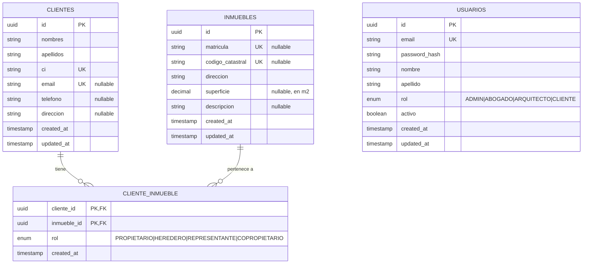

# ERD — SALMA Base de Datos

> Actualizado: 2026-08-14 | Migración: `20260815033841_init`

## Notas de diseño

- `CLIENTE_INMUEBLE` es tabla intermedia **explícita** (no implicit M:N de Prisma) para permitir atributos adicionales futuros como `porcentaje_propiedad`.
- La relación es muchos-a-muchos: un cliente puede tener varios inmuebles; un inmueble puede tener varios propietarios (herencias, copropiedades).
- `CASCADE` en `onDelete` para ambas FKs: si se elimina un cliente o inmueble, se elimina la asociación, no el otro lado.
