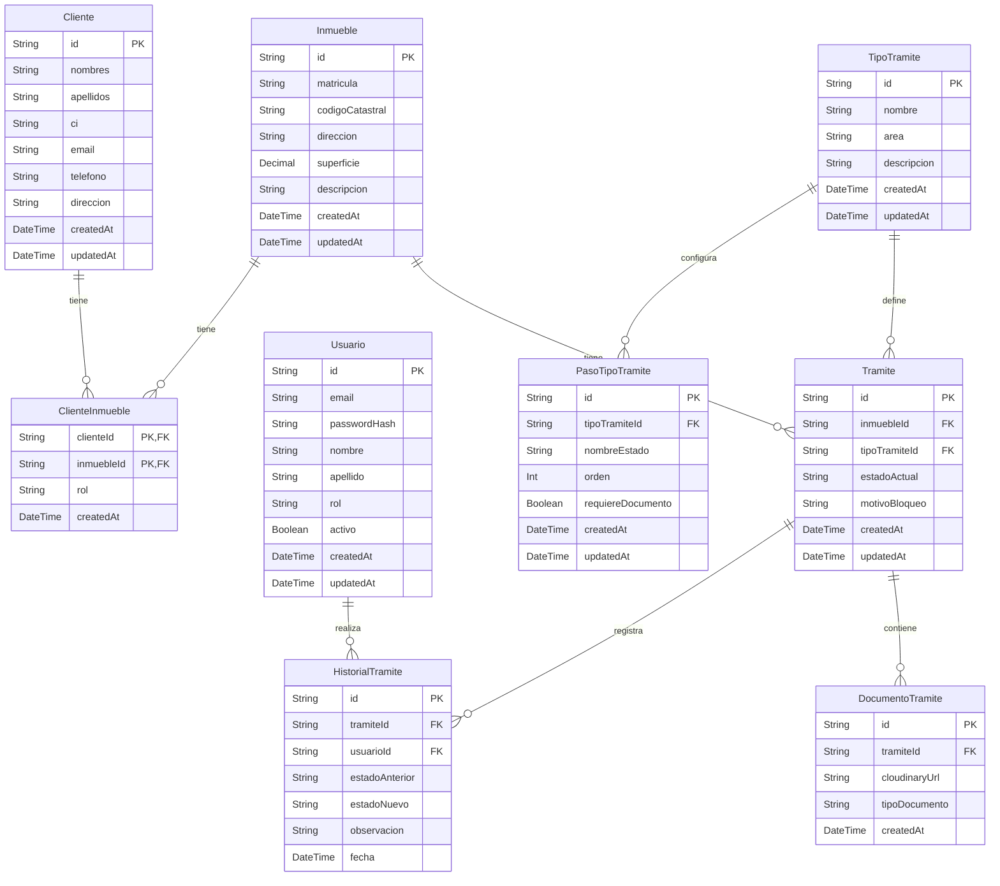

# Diagrama Entidad-Relación (ERD)

```mermaid
erDiagram
    Cliente {
        String id PK
        String nombres
        String apellidos
        String ci
        String email
        String telefono
        String direccion
        DateTime createdAt
        DateTime updatedAt
    }
    Inmueble {
        String id PK
        String matricula
        String codigoCatastral
        String direccion
        Decimal superficie
        String descripcion
        DateTime createdAt
        DateTime updatedAt
    }
    ClienteInmueble {
        String clienteId PK, FK
        String inmuebleId PK, FK
        String rol
        DateTime createdAt
    }
    Usuario {
        String id PK
        String email
        String passwordHash
        String nombre
        String apellido
        String rol
        Boolean activo
        DateTime createdAt
        DateTime updatedAt
    }
    TipoTramite {
        String id PK
        String nombre
        String area
        String descripcion
        DateTime createdAt
        DateTime updatedAt
    }
    PasoTipoTramite {
        String id PK
        String tipoTramiteId FK
        String nombreEstado
        Int orden
        Boolean requiereDocumento
        DateTime createdAt
        DateTime updatedAt
    }
    Tramite {
        String id PK
        String inmuebleId FK
        String tipoTramiteId FK
        String estadoActual
        String motivoBloqueo
        DateTime createdAt
        DateTime updatedAt
    }
    HistorialTramite {
        String id PK
        String tramiteId FK
        String usuarioId FK
        String estadoAnterior
        String estadoNuevo
        String observacion
        DateTime fecha
    }
    DocumentoTramite {
        String id PK
        String tramiteId FK
        String cloudinaryUrl
        String tipoDocumento
        DateTime createdAt
    }

    Cliente ||--o{ ClienteInmueble : "tiene"
    Inmueble ||--o{ ClienteInmueble : "tiene"
    TipoTramite ||--o{ PasoTipoTramite : "configura"
    TipoTramite ||--o{ Tramite : "define"
    Inmueble ||--o{ Tramite : "tiene"
    Tramite ||--o{ HistorialTramite : "registra"
    Usuario ||--o{ HistorialTramite : "realiza"
    Tramite ||--o{ DocumentoTramite : "contiene"
```
